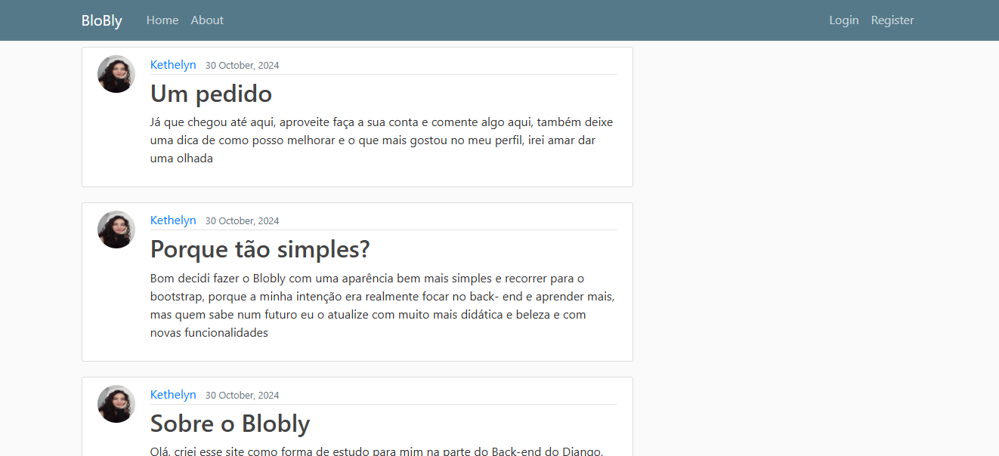

# Blobly

## Sobre o Blobly
o site consiste em um blog, onde os usuários podem fazer suas postagem, deletar, e atualizar, como também ter foto de perfil

### Ferramentas
 - Django
 - Python
 - Html
 - Css
 - Java Script
 - Bootstrap
 - MySQL

 ### Por que foi feito?
 Esse projeto foi desenvolvido com o intuito de    aprendizado, desenvolvi ele assintindo a um video de um canal chamado Corey schufer

 ## Acesse no seu navegador
 [Acessar site](https://kethelyn.pythonanywhere.com)
